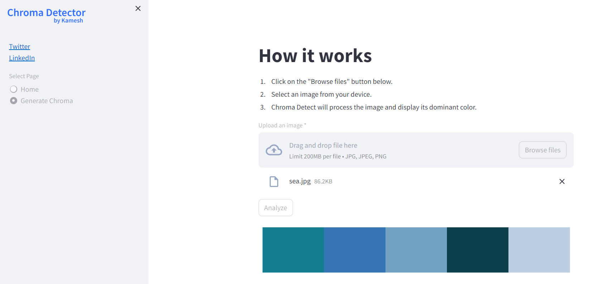

# Chroma Detector WebApp

Welcome to the Chroma Detector WebApp project! This application is designed to identify the top 5 dominant colors in an image using the KMeans algorithm implemented with scikit-learn in Python. With an intuitive user interface powered by Streamlit, analyzing the dominant colors in your images becomes seamless.




## Overview

This project is a Python-based application that employs the KMeans algorithm to identify the top 5 dominant colors in an image. Through the use of Streamlit, a user-friendly interface is provided for users to upload their images and visualize the primary colors present in the image.

## Features

- **Streamlit UI**: Utilizes Streamlit for an interactive and user-friendly interface.
- **KMeans Algorithm**: Implements the KMeans clustering algorithm from scikit-learn for color analysis.
- **Top 5 Dominant Colors**: Provides the top 5 dominant colors along with their respective color codes.

## Installation

Follow these steps to get started with the project:

1. **Create and activate a virtual environment** (optional but recommended for dependency isolation):

    ```bash
    # Create a virtual environment
    python -m venv venv

    # Activate the virtual environment
    # For Windows:
    venv\Scripts\activate

    # For macOS and Linux:
    source venv/bin/activate
    ```

2. **Clone the repository**:

    ```bash
    git clone https://github.com/your-username/image-dominant-color.git
    ```

3. **Install the required dependencies**:

    ```bash
    pip install -r requirements.txt
    ```

## Usage

1. **Navigate to the project directory** in your terminal.

2. **Run the Streamlit app**:

    ```bash
    # For Windows:
    streamlit run Scripts\streamlit-file.py

    # For macOS and Linux:
    streamlit run Scripts/streamlit-file.py
    ```

3. Access the application via the provided URL and upload an image to analyze its dominant colors.


## Technologies Used

- 
- 
- 
- 

